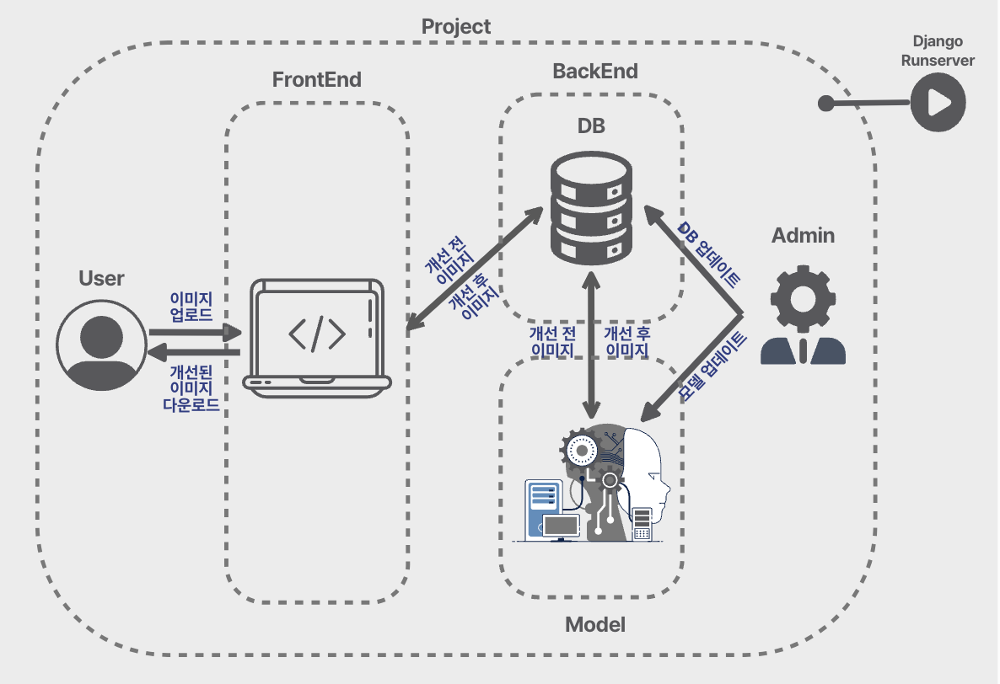
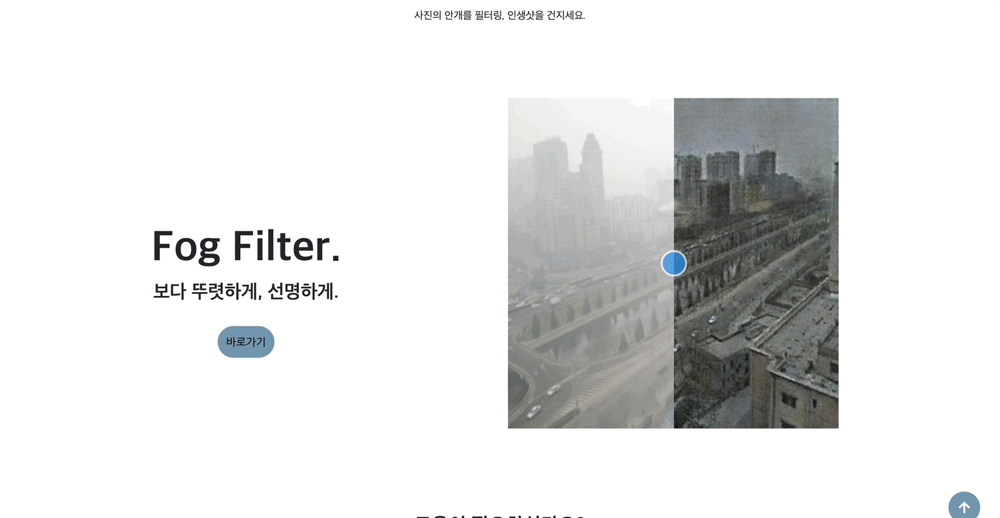
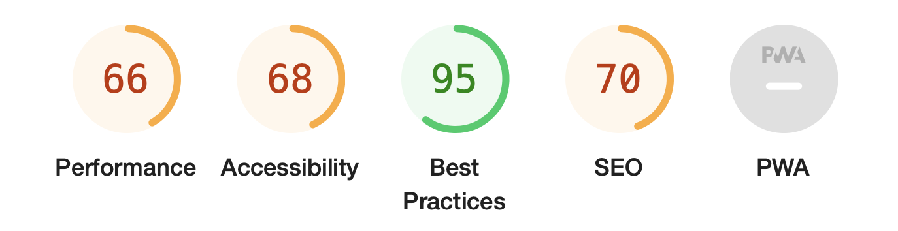
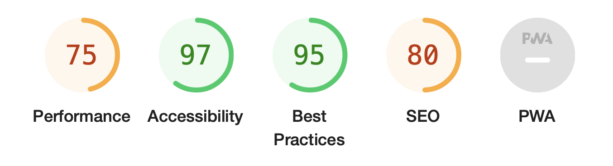

   <header>
      <h1>
        디헤이징을 활용한 안개 이미지의 안개 제거 및 개선
      </h1>
    </header>
    <!-- 프로젝트 기간 -->
    <section style="margin: 1.5rem 0">
      <h2>📆 Period</h2>
      
2023.10.20 ~ 2023.12.13

    </section>
     
    <!-- 프로젝트 구성원 및 기술 스택 -->
    <section style="margin: 1.5rem 0">
      <h2>👥 프로젝트 구성원 및 기술 스택</h2>
      

        

          

            프로젝트 구성원
          

          <ul>
            <li>
              

                FrontEnd
              

              

                
강수현

                
이동엽

              

            </li>
            <li>
              

                BackEnd
              

              

                
김민제

                
홍태광

              

            </li>
            <li>
              

                AI
              

              

                
장우림

                
홍태광

              

            </li>
          </ul>
            
        

        

          

            기술 스택
          

          

            
            
            
            
            
             
            
            
            
            
             
            
            
            
             
            
            
            
          

        

      

    </section>
     
    <!-- 프로젝트 개요 -->
    <section style="margin: 1.5rem 0">
      <h2>📄 프로젝트 개요</h2>
      

        

          
목적

          <ul>
            <li>안개로 인해 만족스러운 사진을 얻지 못한 경험을 감소</li>
            <li>
              안전, 보안 등의 기타 상황에서 안개 제거가 필요할 때 쉽고 간편하게
              사용 가능
            </li>
            <li>
              전문가가 아닌 일반인도 쉽게 사용할 수 있는 이미지 개선 서비스를
              제공
            </li>
          </ul>
            
        

        

          
대상

          

            안개나 미세먼지 등 흐린 이미지를 개선하고자 하는 기업 혹은 개인
          

            
        

        

          

            기획 의도
          

          

            흐린 이미지를 선명하게 개선하는 서비스를 무료로 제공함으로써
            사용자들이 자신의 목적에 맞게 이미지를 자유롭게 이용할 수 있도록 함
          

            
        

        

          

            핵심 기능
          

          <ul>
            <li>안개 필터링 기능(안개 인식, 안개 개선)</li>
            <li>안개 제거 전/후의 사진을 저장할 수 있는 기능</li>
          </ul>
        

      

    </section>
     
    <!-- 역할 -->
    <section style="margin: 1.5rem 0">
      <h2>📝 프로젝트 역할</h2>
      

        

          

            

              FrontEnd 기능 구현
            

            <ul>
              <li>
                

                  BackEnd 담당자와의 협업
                

                

                  <ul>
                    <li style="margin: 0.5rem 0">Django 연동</li>
                    <li style="margin: 0.5rem 0">
                      BackEnd의 원활한 작업을 위해 ERD 초안 작성
                    </li>
                    <li style="margin: 0.5rem 0">
                      마크다운과 문서 작성을 통해 서로 간의 요구 사항 전달
                    </li>
                    <li style="margin: 0.5rem 0">
                      Github과 Discord를 이용하여 작업물 공유 및 발생한 오류
                      수정
                    </li>
                  </ul>
                

              </li>
              <li>
                

                  페이지 디자인 및 레이아웃 설정
                

                

                  

                    Figma와 화면정의서 작성을 토대로 각 페이지의 디자인과
                    레이아웃 설정
                  

                

              </li>
              <li>
                

                  BootStrap, BootStrap Template 같은 자료를 이용하여 CSS,
                  JavaScript, Font 연동
                

              </li>
              <li>
                

                  NavBar와 Footer 구현
                

              </li>
              <li>
                

                  화면 밝기 모드 구현
                

              </li>
              <li>
                

                  예외처리 및 유스케이스 작성한대로 각 페이지에 맞는 script 작성
                

              </li>
              <li>
                

                  Chrome의 Lighthouse를 이용하여 사용자 경험 개선
                

              </li>
            </ul>
              
          

          

            

              문서 작성
            

            <ul>
              <li>
                

                  프로젝트 진행하면서 관련된 문서 작성을 담당
                

              </li>
              <li>
                

                  프로젝트 전반에 대한 문서 / 파일
                

                

                  <ul>
                    <li style="margin: 0.5rem 0">
                      주차 별 수행일지 및회의록 작성
                    </li>
                    <li style="margin: 0.5rem 0">WBS 작성</li>
                    <li style="margin: 0.5rem 0">기획안 작성</li>
                    <li style="margin: 0.5rem 0">공유 폴더 관리</li>
                  </ul>
                

              </li>
              <li>
                

                  FrontEnd 구현을 위한 문서
                

                

                  <ul>
                    <li style="margin: 0.5rem 0">화면정의서 작성</li>
                    <li style="margin: 0.5rem 0">유스케이스 작성</li>
                    <li style="margin: 0.5rem 0">예외처리 작성</li>
                    <li style="margin: 0.5rem 0">
                      타 웹 페이지 분석한 문서 작성
                    </li>
                    <li style="margin: 0.5rem 0">
                      ERD 초안 작성(BackEnd와의 협업 과정)
                    </li>
                  </ul>
                

              </li>
              <li>
                

                  포트폴리오 작성
                

                

                  <ul>
                    <li style="margin: 0.5rem 0">
                      Miri Canvas를 이용하여 PPT 디자인 및 레이아웃 설정
                    </li>
                    <li style="margin: 0.5rem 0">
                      포트폴리오 작성 담당으로 PPT의 전반을 관리 및 제작
                    </li>
                  </ul>
                

              </li>
            </ul>
          

        

      

    </section>
     
    <!-- 성과 -->
    <section style="margin: 1.5rem 0">
      <h2>❤️‍🔥 프로젝트 성과 및 리뷰</h2>
      <figure style="margin-bottom: 2rem">
        
        <figcaption style="text-align:center" align="center">
          프로젝트 워크플로우 | 위의 그림처럼 전체적인 프로젝트가 진행
        </figcaption>
      </figure>
        
        
      <figure style="margin-bottom: 2rem">
        
        <figcaption style="text-align:center" align="center">
          홈 화면 | IntersectionObserver를 이용, 스크롤에 따른 애니메이션 효과
          적용
        </figcaption>
      </figure>
        
        
      <figure style="margin-bottom: 2rem">
        
        <figcaption style="text-align:center" align="center">스크롤바를 이용하여 이미지 개선 전/후 비교</figcaption>
      </figure>
        
        
      

        

          

            프로젝트 성과
          

          <ul>
            <li>
              

                홈 | 서비스 소개를 효과적으로 전달하기 위해 애니메이션과 이미지
                활용
              

              

                <ul>
                  <li style="margin: 0.5rem 0">
                    IntersectionObserver를 이용하여 사용자가 스크롤을 내릴 때
                    애니메이션 효과를 적용
                  </li>
                  <li style="margin: 0.5rem 0">
                    이미지 개선 전/후를 명확히 보여주기 위해 스크롤바를 이용하여
                    비교
                  </li>
                </ul>
              

            </li>
            <li>
              

                홈 | Chrome의 Lighthouse를 이용해 사용자 경험 개선
              

              

                <ul>
                  <figure>
                    
                    <figcaption style="text-align:center">Lighthouse 적용 전</figcaption>
                  </figure>
                  <figure>
                    
                    <figcaption style="text-align:center">Lighthouse 적용 후</figcaption>
                  </figure>
                  <li style="margin: 0.5rem 0">
                    script에 defer 속성을 부여하고 이미지에 alt와 같은 부가적인
                    속성을 통해 Performance는 66%에서 75%로, Accessibility는
                    68%에서 95%로 사용자 경험을 개선
                  </li>
                </ul>
              

            </li>
          </ul>
            
        

        

          

            프로젝트 리뷰
          

          <ul>
            <li>
              

                좋았던 점
              

              

                <ul>
                  <li style="margin: 0.5rem 0">
                    IntersectionObserver를 사용하여 애니메이션을 적용하는 방법을
                    배운 점
                  </li>
                  <li style="margin: 0.5rem 0">
                    화면 밝기 모드를 변화시켜 사용자의 취향대로 조정했던 점
                  </li>
                  <li style="margin: 0.5rem 0">
                    Git을 사용하여 fork하고 pull request를 통해 협업을 원활히
                    했던 점
                  </li>
                  <li style="margin: 0.5rem 0">
                    CSS와 JavaScript를 어느 정도 최적화하여 프로젝트를 가볍게
                    만들려고 노력했던 점
                  </li>
                  <li style="margin: 0.5rem 0">
                    Chrome의 Lighthouse를 이용하여 그들이 제공하는 피드백을
                    적용시켜 실제로 성능을 개선한 점
                  </li>
                  <li style="margin: 0.5rem 0">
                    팀원들 간의 소통과 협업이 활발하게 진행되어 성공적으로
                    프로젝트를 마무리한 점
                  </li>
                </ul>
              

            </li>
            <li>
              

                아쉬웠던 점
              

              

                <ul>
                  <li style="margin: 0.5rem 0">
                    React나 Vue 같은 프레임워크를 사용하여 Single Page
                    Application을 만들어보고 싶었으나 당시에는 아직 배우지
                    못해서 적용하지 못한 점
                  </li>
                  <li style="margin: 0.5rem 0">
                    Tailwind CSS를 이용하여 스타일을 직접 적용하고 싶었으나 팀원
                    모두의 프로젝트에 Tailwind CSS를 세팅해야했기 때문에
                    시간적인 여유가 없어 적용하지 못한 점
                  </li>
                </ul>
              

            </li>
            <li>
              

                다음에 시도해보고 싶은 점
              

              

                <ul>
                  <li style="margin: 0.5rem 0">
                    React나 Vue, Tailwind CSS처럼 실제 프론트엔드 실무에서
                    사용하는 프레임워크 등을 사용하여 프로젝트를 경험해보고 싶음
                  </li>
                  <li style="margin: 0.5rem 0">
                    전반적인 디자인을 직접 설정하여 적용해보는 경험을 해보고
                    싶음
                  </li>
                  <li style="margin: 0.5rem 0">
                    Chrome의 Lighthouse에서 제공해주는 피드백을 더 적용시켜보고
                    싶음
                  </li>
                </ul>
              

            </li>
          </ul>
        

      

    </section>
     
   <section style="margin: 1.5rem 0">
      <h2>📹 최종 구현 영상</h2>

https://github.com/Imshyeon/MLP_Final_PJ/assets/93653747/4cde96c1-2574-4718-9f68-bcb1796ce7d0

   </section>
