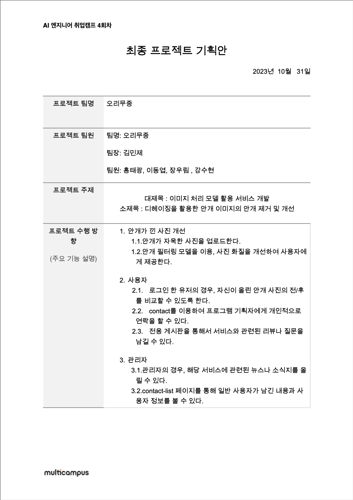
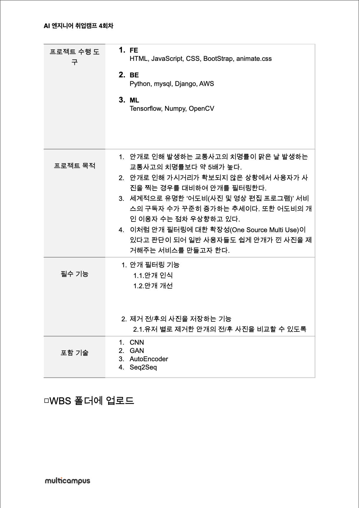
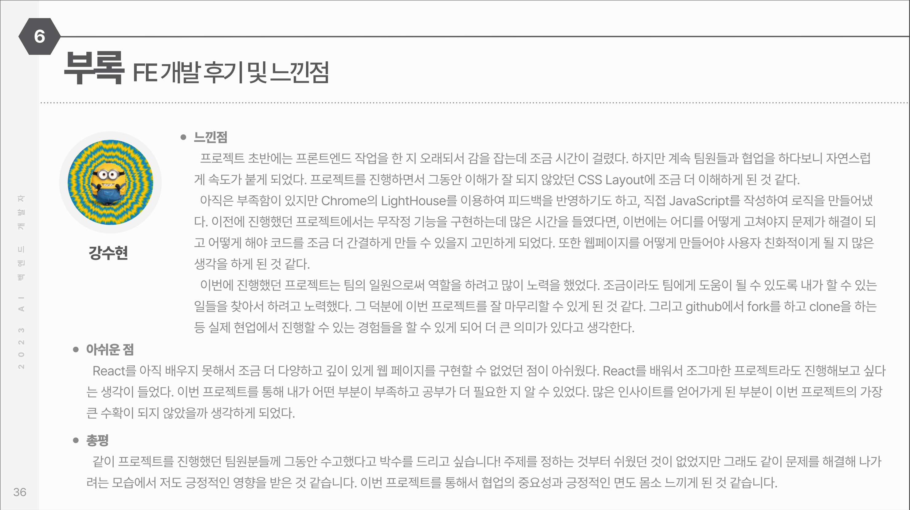

# 디헤이징을 활용한 안개 이미지의 안개 제거 및 안개 개선

### 목차

[📌 프로젝트 소개](#📌-프로젝트-소개) 
[📌 기획안](#📌-기획안) 
[📌 포트폴리오](#📌-포트폴리오) 
[📌 개인 진행 부분](#📌-개인-진행-부분) 
[📌 느낀점](#📌-느낀점) 
 

## 📌 프로젝트 소개

### 주제 : 디헤이징을 활용한 안개 이미지 개선 &rarr; 안개가 껴서 흐릿한 이미지에서 안개를 제거해주는 이미지 개선 서비스

- 목표
  1. 안개로 인해 만족스러운 사진을 얻지 못한 경험을 감소한다.
  2. 안전, 보안 등의 기타 상황에서 안개 제거가 필요할 때 쉽고 간편하게 사용 가능하다.
  3. 전문가가 아닌 일반인도 쉽게 사용할 수 있는 이미지 개선 서비스를 제공한다.
       
- 홈페이지 영상
  

  1. 스크롤을 내렸을 때 안개가 걷히는 효과를 제공
  2. animate.css와 IntersectionObserver를 이용하여 애니메이션 효과를 제공
       

  

  1. scroll을 이용하여 이미지 개선 전/후를 표현
     

- 전체적인 페이지 | 📎 [Figma 링크](https://www.figma.com/file/MItQzj2MSCrGYqj0XcLl0k/%EC%95%88%EA%B0%9C?type=design&node-id=0%3A1&mode=design&t=koiWtBhCr8oWvvKS-1)
 

  
  

## 📌 기획안
<table>
<tr>
<td>

</td>
<td>

</td>
</tr>
</table>

## 📌 포트폴리오
📎 [포트폴리오 보러가기](https://www.miricanvas.com/v/12p6qhb) 
📎 [공유 드라이브 보러가기](https://drive.google.com/drive/folders/1d3XtKARP9co6z6e4jxyTxbgWYlBZhqEI?usp=sharing)

## 📌 개인 진행 부분
* 주 역할 : FrontEnd 기능 구현, 문서(회의록, 수행일지 등) 작성, PPT 제작
1. 문서화
   1. 화면정의서 작성
   2. 타 웹 페이지 분석 : 디자인과 제품 소개 방식 등을 효과적으로 전달하는 방법을 분석하였다.
   3. 예외 처리 및 유스케이스 작성
   4. ERD 요소 작성 : 프로젝트를 진행하는데 어떤 요소가 필요한 지 정리하여 BE와 공유
   5. 주차 별 수행일지, 회의록 작성

2. 기능 구현
   1. Django와 연동
   2. BE 파트와의 소통 및 연동
   3. FE에서 작업한 내용을 github를 이용하여 공유
   4. bootstrap, bootstrap template 등 각종 자료를 이용하여 CSS, JavaScript, 폰트 등 연동
   5. NavBar와 Footer 작성
   6. 페이지 디자인 / 레이아웃
      1. Home 페이지의 전반적인 디자인과 레이아웃 구성
      2. About Us 전반적인 디자인과 레이아웃 구성
      3. Community - 문의/리뷰 - News의 전반적인 디자인, 레이아웃 구성
      4.  Review와 News 세부 페이지 전반적인 디자인과 레이아웃 구성
      5.  Contact와 Contact-List의 전반적인 디자인과 레이아웃 구성
      6.  Login / Logoiut / 비밀번호 및 아이디 찾기 페이지의 전반적인 디자인과 레이아웃 구성
      7.  Admin/User의 프로필 페이지 전반적인 디자인과 레이아웃 구성
   7. 화면 밝기 모드(화이트모드/다크모드) 구현
   8. 예외처리 및 유스케이스에 작성한대로 각 페이지에 맞는 script 작성
   9. Chrome의 Lighthouse를 이용하여 사용자 경험 개선
   
3. 포트폴리오 작성
   1. 미리캔버스에서 제공하는 포트폴리오를 기반으로 하여 PPT 디자인 및 레이아웃 구성
   2. PPT 작성
   3. 자료조사
      1. 교통사고 - 도로교통공단, 교통사고분석시스템, 기상청 통계 이용
      2. 어도비 - KB 증권 어도비 리포트, KDI 경제정보센터 통계 이용

## 📌 느낀점
